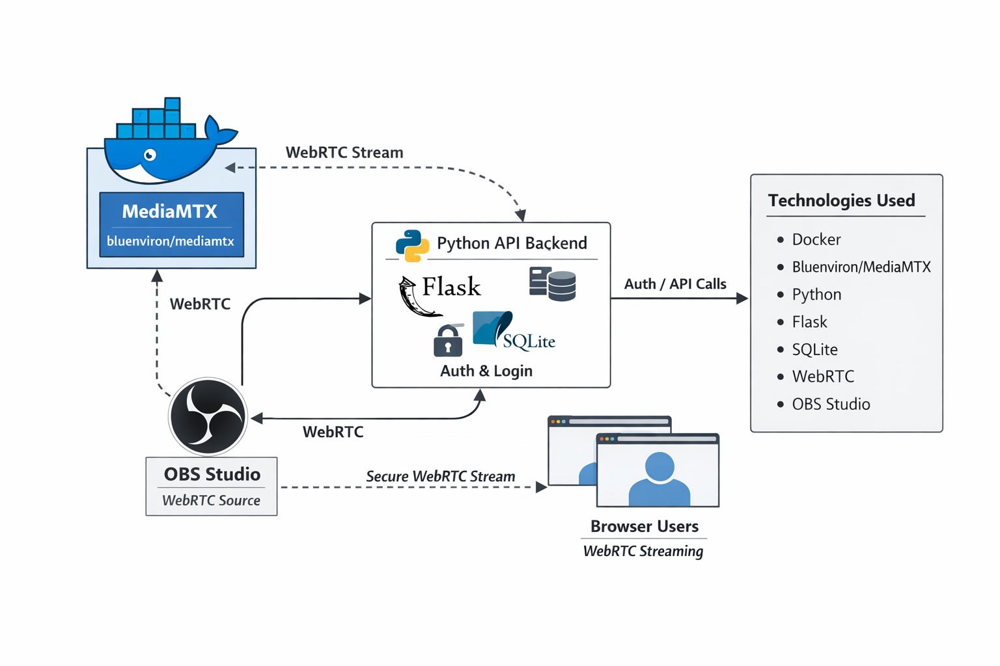
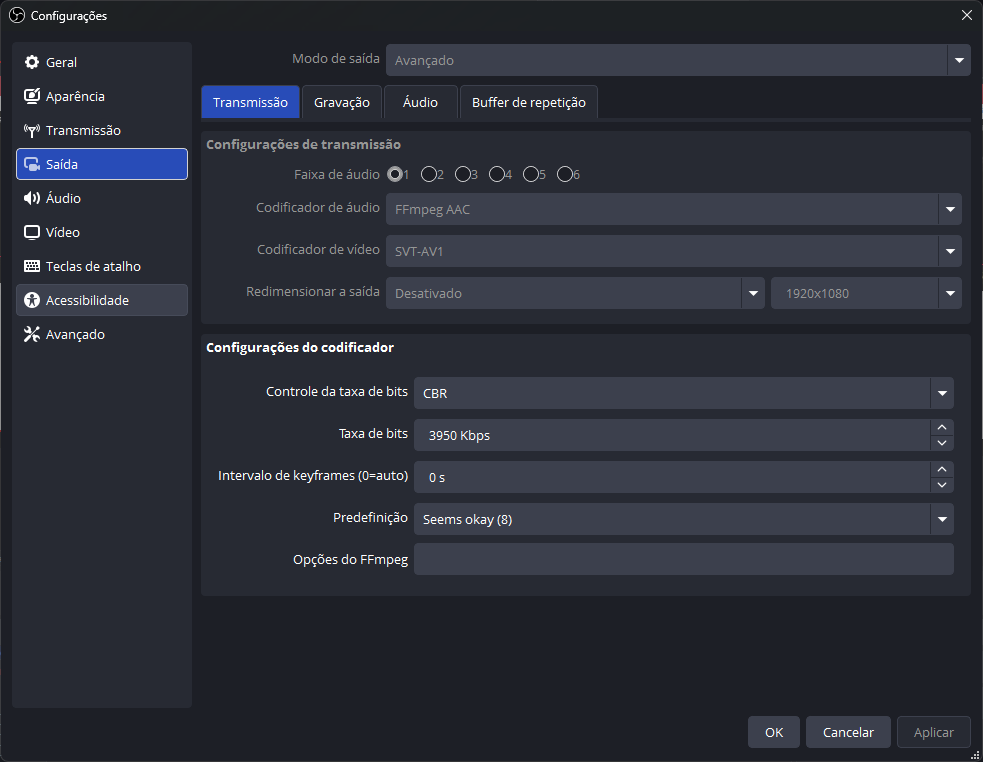
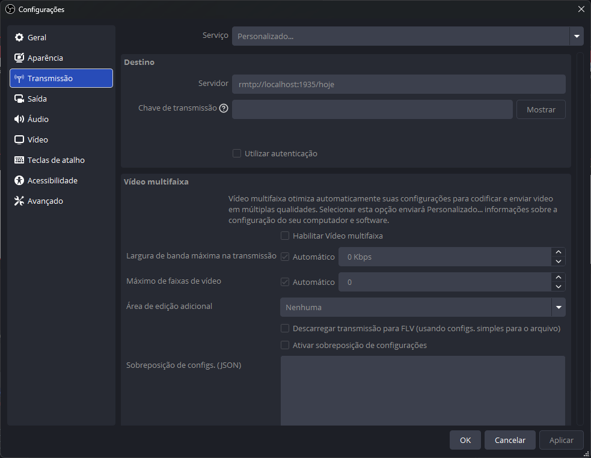
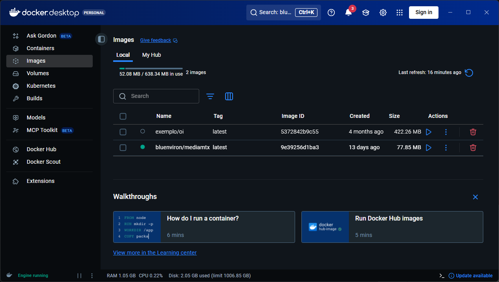
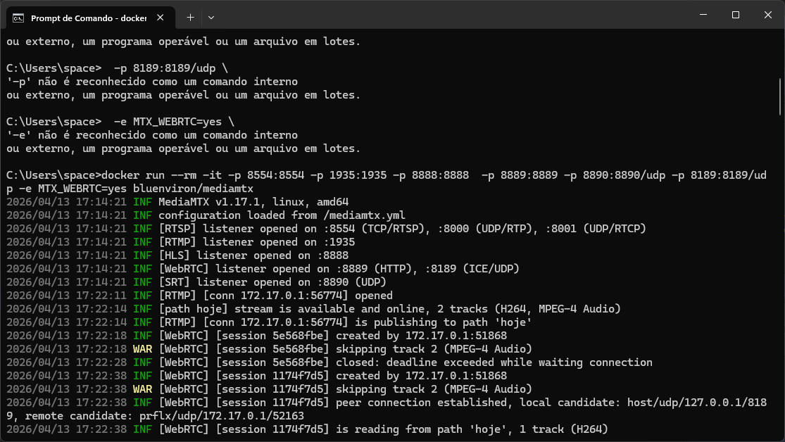
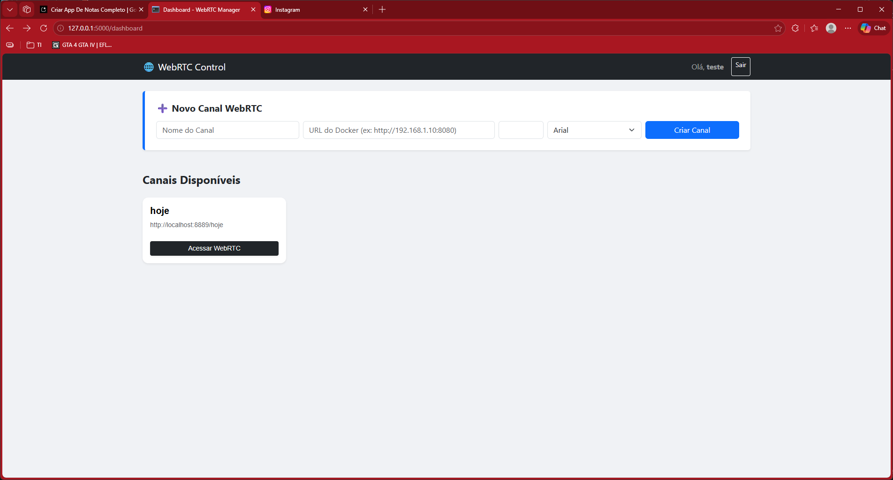
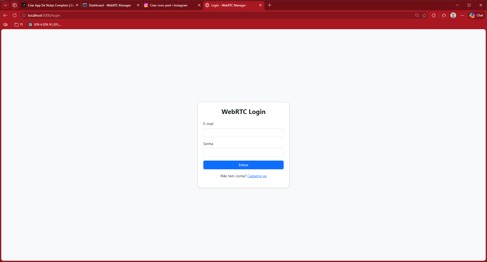
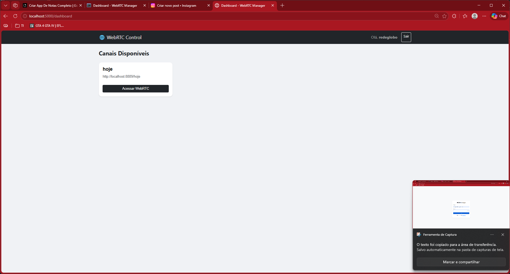
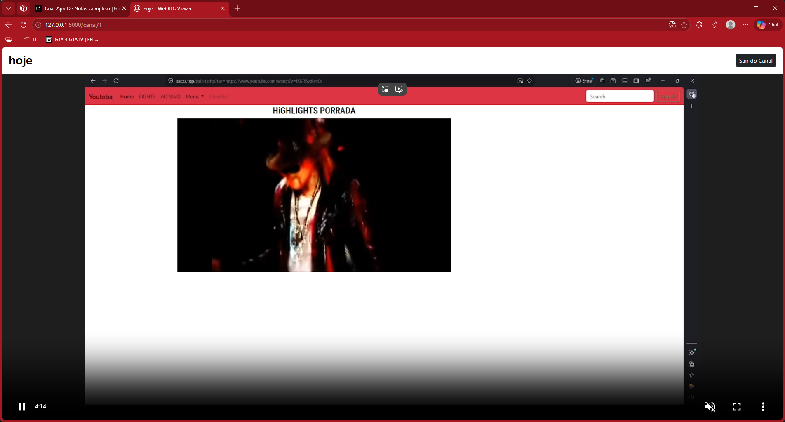

# 📺 Streaming System

Sistema de streaming desenvolvido para estudo e prática de tecnologias modernas.

## 🖼️ Imagem de exemplo



## 🚀 Funcionalidades
- Transmissão de vídeo em tempo real
- Login de usuários
- CRUD para gerenciamento de dados
- Interface responsiva com HTML5 e CSS
- Persistência de dados com SQLite
- Integração com OBS Studio para envio de streams

## 🛠️ Tecnologias utilizadas
- **Python** → lógica principal do sistema
- **WebRTC** → comunicação em tempo real
- **WHIP** → protocolo para ingestão de mídia
- **RTMP** → protocolo de transmissão
- **HTML5** → estrutura da interface
- **CSS** → estilização
- **CRUD** → operações de banco de dados
- **SQLite** → banco de dados leve e integrado
- **Docker** → containerização do servidor de mídia
- **Bluenviron/MediaMTX** → servidor de mídia para ingestão e distribuição
- **OBS Studio** → software de transmissão para enviar vídeo ao servidor

## 🏗️ Arquitetura do Sistema
O sistema funciona em três camadas principais:

1. **Servidor de mídia (MediaMTX em Docker)**  
   - Executa a imagem `bluenviron/mediamtx` em um container Docker.  
   - Recebe streams via **RTMP** (ex.: enviados pelo OBS Studio).  
   - Disponibiliza canais de saída via **WebRTC** ou **WHIP** para consumo no navegador.

2. **Servidor web (Python + HTML5/CSS)**  
   - Responsável pela interface de login e CRUD de usuários.  
   - Exibe os canais de streaming, possivelmente via **iframe** embutindo players conectados ao MediaMTX.  
   - Gerencia persistência de dados com **SQLite**.

3. **Cliente de transmissão (OBS Studio)**  
   - O usuário configura o OBS para enviar vídeo ao servidor MediaMTX via RTMP.  
   - O MediaMTX distribui esse stream para os clientes conectados via navegador.

### 🔄 Fluxo resumido
- Usuário abre o **site** → faz login → escolhe canal.
- O **servidor web** mostra o player (iframe) conectado ao MediaMTX.
- O **OBS Studio** envia vídeo para o MediaMTX via RTMP.
- O **MediaMTX** entrega o vídeo aos navegadores via WebRTC/WHIP.
- O **SQLite** guarda dados de login e CRUD de usuários.

## 📦 Instalação
Clone o repositório:
```bash
git clone https://github.com/seuusuario/streamming_system-.git
```
## Execute primeiro o webrtc o servidor docker
```bash
docker run --rm -it -p 8554:8554 -p 1935:1935 -p 8888:8888  -p 8889:8889 -p 8890:8890/udp -p 8189:8189/udp -e MTX_WEBRTC=yes bluenviron/mediamtx
```
## Execute o servidor web do projeto
```bash
python run.py
```

## Transmita videos com o obs-studio
Voce configura assim olhe essas imagens.





## Telas do sistema





## DICA PARA QUEM DESEJA TESTAR
Vocês podem usar o ngrok e tipo um upnp que nao precisa abrir portas
passa direto....
[ngrok](https://medium.com/desenvolvendo-com-paixao/ngrok-do-localhost-para-o-mundo-5445ad08419)
